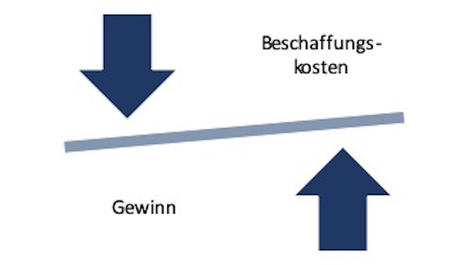

# Die Beschaffungsfunktion als Bestandteil des Unternehmens

## **1 Einleitung**

Das Ziel der vorliegenden Arbeit ist es, die Beschaffungsfunktion im Hinblick auf die Wertschöpfung und deren Aufgaben zu analysieren, um die Bedeutung und Wichtigkeit dieser Funktion im Unternehmen zu konkretisieren. Dazu dienen folgende Leitfragen:

1.  Welche Funktion übernimmt die Beschaffungsfunktion im Wertschöpfungsprozess?
1.  Inwieweit ist die Präsenz der Beschaffungsfunktion essentiell für Unternehmen?
1.  Welchen Einfluss hat die Digitalisierung auf die Beschaffungsfunktion?

Die Beschaffungsfunktion ist im Unternehmen als fester Bestandteil integriert. Das „Einkaufen“ und der Einkaufsprozess an sich, werden mehrfach mit der Beschaffung gleichgesetzt. Sowohl in der Literatur als auch in der Praxis besitzt die Beschaffung viele Begriffe, zwischen denen Analogien herrschen (Weele und Eßig, 2017, S. 20). Mit einem strategischen und strukturierten Beschaffungsmanagement kann die Beschaffungsfunktion nicht nur Wettbewerbsvorteile erzielen oder das Unternehmen mit Produktionsfaktoren versorgen. Sie trägt nachhaltig zur Steigerung des Gewinns und Senkung der Kosten des Unternehmens bei. Darüber hinaus schreitet die Digitalisierung mit großen Schritten voran und wirkt sich auf jeden einzelnen Bestandteil im Unternehmen aus. Auch die Beschaffung bleibt von ihr nicht verschont und steht vor grundlegenden Veränderungen.

## **2 Die Beschaffungsfunktion im Unternehmen**

Die Beschaffungsfunktion gehört zu den Kernfunktionen des Unternehmens. Alternativ wird sie auch als Procurement-Funktion, Einkaufsfunktion oder ganz allgemein als Beschaffung definiert (Bräkling und Oidtmann, 2012, S. 5; Kummer, Grün, und Jammernegg, 2013, S. 114). Der Begriff der Beschaffung kann sowohl im engeren als auch im weiteren Sinne definiert werden. Unter der Definition im weiteren Sinne versteht man alle Mittel und Maßnahmen, die zur Versorgung des Unternehmens mit Produktionsfaktoren beitragen und nicht selbst hergestellt werden können. Dazu zählen sowohl Roh-, Hilfs- und Betriebsstoffe, Personal, Dienstleistungen, Kapital oder auch Ersatzteile. Die Definition im engeren Sinne fokussiert sich auf die Versorgung mit Material (Roh-, Hilfs-, und Betriebsstoffe, Zuliefererteile), Ersatzteilen, Handelswaren und Dienstleistungen. Die Versorgung des Unternehmens mit den eben genannten anderen Faktoren wie Kapital und Personal werden im engeren Sinne nicht berücksichtigt (Kummer, Grün, und Jammernegg, 2013, S. 114-117; Lorenzen und Krokowski, 2018, S. 5).

Im Verlauf der vorliegenden Arbeit steht der engere Definitionsbegriff im Fokus. Ebenso gelten die Begriffe der Beschaffung und Beschaffungsfunktion als Synonym.

### **2.1 Funktion im Wertschöpfungsprozess**

Die Beschaffungsfunktion gehört im Unternehmen als fester Bestandteil zum Wertschöpfungsprozess. Sie steht vor der Aufgabe, das Unternehmen mit dem für die Wertschöpfung notwendigen Input zu versorgen. Dazu gehören im Wesentlichen materielle Güter, Dienstleistungen, Energieprodukte oder auch Rechte. Diese Inputfaktoren werden auch als Beschaffungsobjekte bezeichnet. Bei der Versorgungsabsicherung folgt die Beschaffung vier Grundsätzen, die das Management erleichtern:

- Kosten senken,
- Qualität verbessern,
- Geschwindikeit erhöhen,
- Innovationen treiben.

Die Beschaffung stellt das Bindeglied zwischen der betrieblichen Wertschöpfung und den Beschaffungsmärkten dar und ist daher fest im Unternehmen als Organisationseinheit verankert (Bräkling und Oidtmann, 2012, S. 4-5). Nachhaltiges und profitables Wachstum ist vielen Unternehmen sehr wichtig und wird aktiv priorisiert. Alle Funktionen im Unternehmen müssen ihren Beitrag leisten, damit dieses Ziel erfolgreich gewährleistet werden kann. Die Beschaffungsfunktion trägt ebenso ihren Teil dazu bei wie alle anderen Geschäftseinheiten. Ihr Ziel ist die Sicherstellung der Versorgung zu optimalen Kosten, um die Unternehmensziele zu garantieren (Bräkling und Oidtmann, 2019, S. 3). Darüber hinaus beeinflusst die Beschaffung erheblich die Kosten und den Gewinn eines Unternehmens.

Sie kann zur Kostensenkung beitragen und verbessert somit die Erlöse. Die Umsatzerlöse von Unternehmen werden heute zu mehr als 50 Prozent für Güter und Dienstleistungen verwendet, die von Lieferanten bezogen werden. Folglich sollten Lieferantenbeziehungen effizient und konstruktiv gestaltet sein, um kurzfristige Finanzergebnisse und langfristige Stellungen im Wettbewerb zu sichern (Weele und Eßig, 2017, S. 13).

### **2.2 Aufgaben der Beschaffung**

Damit die Versorgung des Unternehmens mit den benötigten Beschaffungsobjekten sichergestellt ist, werden alle dafür notwendigen markt- bzw. unternehmensbezogenen Maßnahmen bis hin zum abschließenden Vertragsmanagement in die Beschaffungsfunktion integriert (Bräkling und Oidtmann, 2012, S. 5). Die Aufgaben in der Beschaffung unterscheiden sich in sieben Beschaffungsprozesse.

- Die Bedarfsanforderung bzw. -ermittlung stellt die direkte Auslösung des Beschaffungsprozesses dar. Bedarfsträger, wie z. B. die Produktion, melden einen Bedarf hinsichtlich der Art, Qualität, Menge, Zeitpunkt und Ort an.
- Die Beschaffungsmarktforschung setzt sich mit Marktinformationen auseinander. Dies beinhaltet das Sammeln von Daten oder speziellen Analysen, um bestimmte Beschaffungsentscheidungen fällen zu können.
- Make-or-Buy-Entscheidungen bewerten, ob Produkte selbst hergestellt oder fremdbezogen werden sollten. Kriterien wie z. B. Kernkompetenzen, Kosten oder Kapitalbedarf helfen bei der Beurteilung.
- Die Vertragsvereinbarung und Bestellabwicklung bearbeitet Bestellmengen und -zeitpunkte, Lieferbedingungen, Rechnungen oder auch Wareneingänge.
- Das Lieferantenmanagement analysiert die Lieferantenkreise, um anschließend Lieferanten auswählen, beurteilen und deren Entwicklung nach Maßgabe der Lieferantenpolitik bewerten zu können.
- Die Beschaffungspolitik orientiert sich an der übergeordneten Unternehmenspolitik und leitet Ziele, Grundsätze und Programme für die Beschaffung selbst davon ab.
- Um Beschaffungsprozesse und Zielvorgaben steuern zu können, entwickelt das Beschaffungscontrolling entsprechende Instrumente zur Überwachung. Dies trägt zur Unterstützung des Managements bei und bewirkt die rechtzeitige Einleitung von Korrekturmaßnahmen.

Verschiedene Institutionen, auch Bedarfsträger genannt, sind an den Beschaffungsprozessen beteiligt. Dazu gehören Kunden, Lieferanten, der Absatz und die Beschaffungsspezialisten bzw. auch die Logistik für den Güterfluss (Kummer, Grün, und Jammernegg, 2013, S. 117-119). Bräkling und Oidtmann unterteilen die Aufgaben der Beschaffungsfunktion im Allgemeinen in die Planung, das operative Geschäft und das Controlling (2019, S. 28). Darunter fallen die Teilaufgaben, die auch schon Kummer, Grün und Jammernegg definierten.

### **2.3 Einfluss der Digitalisierung**

Mit der Digitalisierung sind neue Technologien und Produktionsverfahren entstanden, die im Zusammenhang mit Industrie 4.0 stehen. Kommunikation in Echtzeit, digitale Vernetzung und intelligente Systeme werden die Einkaufsprozesse nachhaltig beeinflussen. Im Rahmen der Veränderung wird auch von „Einkauf 4.0“ gesprochen. Die Kernaufgabe der Beschaffung ist die Versorgung des Unternehmens mit benötigten, jedoch nicht selbst hergestellten Gütern. Dazu gibt es bereits mehrere technische Maßnahmen, die die Beschaffung in den Aufgaben unterstützen. Systeme zur Materialbedarfsplanung (Material-Requirements-Planning-Systems, MRP), unternehmensweite IT-Systeme zur besseren Abstimmung von Produktion und Nachschub (Enterprise-Resource-Planning-Systems, ERP) oder auch spezielle Einkaufssysteme zur operativen und taktischen Unterstützung (eProcurement) gehören schon jetzt zum Alltag in der Beschaffung (Kleemann und Glas, 2017, S. 8).
In allen in 2.2 genannten Aufgabenbereichen findet man diverse Veränderungen, hervorgerufen durch die Digitalisierung. Die Industrie 4.0 wird die Beschaffungsobjekte maßgeblich verändern, da in Zukunft alle Produkte und Dienste miteinander vernetzt sein sollen. Zugekaufte Materialien sollten auf die Vernetzung ausgelegt sein. Die Bedarfsermittlung muss sich folglich darauf einstellen, dass sich bisherige Beschaffungsobjekte weiterentwickeln und neue Objekt- bzw. Warengruppen etabliert werden. In diesem Zusammenhang wird sich nicht das „Wie“ in der Beschaffung ändern, sondern dass „Was“. Auch die Beschaffungsmarktforschung wird durch Big Data und intelligente Systeme zukünftig entlastet. Intelligente Systeme stellen Prognosen oder Entscheidungshilfen bereit oder entscheiden gegebenenfalls sogar selbst. Sie ersetzen durch den Menschen vorgenommene Einschätzungen und Entscheidungen. Ebenso Make-or-Buy-Entscheidungen oder Vertragsvereinbarungen werden auf ähnliche Art und Weise organisiert. Letzte Entscheider werden selbstverständlich bei strategischen Einkaufsvorhaben abschließend Freigaben erteilen, jedoch ist von einer Entscheidungsunterstützung zukünftig stark auszugehen. Das Lieferantenmanagement beinhaltet gleichermaßen analytische Methoden, um potenzielle Lieferanten für den Einkäufer zu bestimmen. Darüber hinaus werden zunehmend Datenbrillen mit einer Software für Gemütszustände entwickelt, um diese in Verhandlungen strategisch einsetzen zu können. Die Bestellabwicklung mit ihrem operativen Aufgabengebiet wird ebenso von Veränderungen betroffen sein. Mithilfe von eProcurement werden heute Bestellentscheidungen noch von Menschen ausgelöst und automatisiert abgewickelt. Zukünftige intelligente Einkaufssysteme sind in der Lage, Bedarfsverläufe autonom zu analysieren und auf Basis derer Bestellimpulse auszulösen. Der Beschaffungsprozess verändert sich von einer bloßen Prozessunterstützung durch eProcurement zu einem End-to-end-Prozess mit IT-Systemen. Diese innovativen Systeme und Maßnahmen stellen den Einkauf 4.0 dar (Kleemann und Glas, 2017, S. 9-10).

## **3 Fazit**

Die Beschaffungsfunktion ist eine der wichtigsten Elemente im Unternehmen und fest in der Wertschöpfungskette verankert. Ihre Aufgabengebiete sind für den weiteren Verlauf der Wertschöpfung essentiell. Die Beschaffungsobjekte sind die Basis für die Weiterführung in anderen Unternehmensbereichen wie der Produktion oder Logistik. Die Beschaffung selbst ist darüber hinaus maßgeblich am Gesamterfolg des Unternehmens beteiligt. In der Beschaffung fallen regelmäßig hohe Kosten an, da das Unternehmen für den weiteren Wertschöpfungsprozess versorgt sein muss. Kosteneinsparungen beim Beschaffungsprozess können erhebliche Konsequenzen auf die Gewinn haben und verbessern somit die Umsatzrendite (Weele und Eßig, 2017, S. 29-30). „Jeder Euro,der in der Beschaffung eingespart wird, trägt in voller Höhe zum Gewinn bei“ (2017, S. 29), fügt Weele und Eßig hinzu. Es ist demnach unumgänglich, die Entscheidungen und Aufgaben in der Beschaffung strategisch und analytisch zu behandeln, um sowohl Kosten einzusparen als auch das Unternehmen stark zu präsentieren und Lieferantenbeziehungen langfristig aufrecht zu erhalten.
Des Weiteren stellt die Digitalisierung in Zukunft große und neue Herausforderungen an die Beschaffungsfunktion, die es zu meistern gilt. Die allgemeinen Beschaffungsobjekte stehen vor Veränderungen und intelligente Systeme werden bestimmten Bereichen der Beschaffung eine Unterstützung bieten. Es ist schon lange offensichtlich, dass die Digitalisierung aus Endkundensicht ein Game Changer ist. Vielen Unternehmen wird nun bewusst, dass sich aus Unternehmenssicht vieles in den nächsten Jahren ändern wird. Sie sollten auf diese Fortschritte vorbereitet sein, sowohl die Beschaffungsfunktion selbst als auch weitere Unternehmensbereiche. Zukünftig sind die Unternehmen sind gezwungen, sich mit diesen neuen Möglichkeiten auseinanderzusetzen und sich anzupassen oder sie werden zusehen müssen, wie ihre Konkurrenz an ihnen vorbeizieht.

## **Literaturverzeichnis**

**Bräkling, Elmar und Oidtmann, Klaus (2012):** Power in Procurement: Erfolgreich einkaufen - Wettbewerbsvorteile sichern - Gewinne steigern. Wiesbaden: Springer Gabler.

**Bräkling, Elmar und Oidtmann, Klaus (2019):** Beschaffungsmanagement: Erfolgreich einkaufen mit Power in Procurement. 2., aktualisierte und überarbeitete Auflage. Wiesbaden: Springer Gabler.

**Kleemann, Florian C. und Glas, Andreas (2017):** Einkauf 4.0: Digitale Transformation der Beschaffung. Wiesbaden: Springer Gabler.

**Kummer, Sebastian; Grün, Oscar und Jammernegg, Werner (Hrsg.) (2013):**
Grundzüge der Beschaffung, Produktion und Logistik. 2., aktualisierte Aufl., München: Pearson Studium.

**Lorenzen, Klaus Dieter und Krokowski, Wilfried (2018):** Einkauf. Studienwissen kompakt. Wiesbaden: Springer Gabler.

**Weele, Arjan J. van und Michael Eßig (2017):** Strategische Beschaffung: Grundlagen, Planung und Umsetzung eines integrierten Supply Management. Wiesbaden: Springer Gabler.
